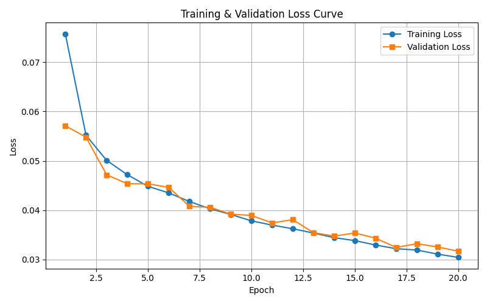
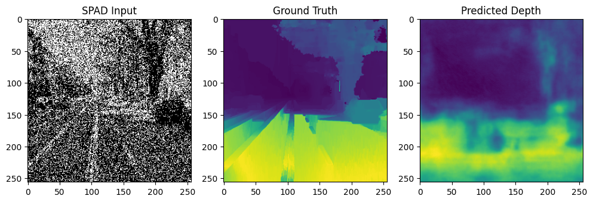

# SPAD Depth Estimation Project

This project implements deep learning models for monocular depth estimation from Single Photon Avalanche Diode (SPAD) camera images. SPAD cameras detect individual photons and provide exceptional temporal resolution, making them suitable for challenging conditions like extreme low-light, high dynamic range, and motion blur scenarios.

## Project Overview

### Problem Statement
Estimate depth maps from single SPAD images using deep learning approaches. The challenge involves working with binary-like photon detection data that differs significantly from conventional RGB images.

### SPAD Camera Technology
- **Single Photon Detection**: SPAD cameras detect individual photons, generating binary outputs when photons strike the detector
- **High Temporal Resolution**: Capable of capturing up to 100,000 frames per second
- **Noise Advantages**: Direct photon counting eliminates read noise and reduces intermediate processing steps
- **Applications**: Excellent for low-light conditions, high dynamic range scenes, and motion blur reduction

## Results

### Training Performance
The best performing model achieved excellent convergence with minimal overfitting:



**Key Results:**
- **Best Validation Loss**: 0.0353 (achieved at epoch 28)
- **Model**: Custom DepthNet with layer normalization
- **Optimizer**: SGD with momentum (0.9) and learning rate (0.01)
- **Training Characteristics**: Rapid initial convergence followed by steady improvement

### Sample Predictions
The model produces high-quality depth estimations from SPAD images:



The prediction shows the model's ability to capture depth information from sparse SPAD data, producing smooth and accurate depth maps.

## Architecture Implementations

### 1. U-Net Architecture
Enhanced U-Net with batch normalization for depth estimation:
- **Encoder**: Progressive downsampling with convolutional layers and max pooling
- **Decoder**: Upsampling with bilinear interpolation and skip connections
- **Skip Connections**: Preserve spatial information lost during downsampling
- **Features**: Batch normalization, ReLU activations, sigmoid output

### 2. Multi-Scale Deep Network (Eigen et al.)
Two-stage depth estimation approach:
- **Coarse Network**: Predicts overall scene depth with larger receptive field
- **Fine Network**: Refines global predictions locally using both image and coarse depth
- **Architecture**: Based on "Depth Map Prediction from a Single Image using a Multi-Scale Deep Network" (NIPS 2014)

### 3. Custom DepthNet
Custom architecture with layer normalization:
- **Layer Normalization**: Applied instead of batch normalization for better stability
- **Skip Connections**: U-Net style connections for feature preservation
- **Flexible Design**: Adaptable to different input sizes and channel configurations

## Project Structure

```
├── config.py          # Configuration settings
├── dataset.py         # SPAD dataset handling
├── models.py          # Model architectures
├── train.py           # Training utilities
├── utils.py           # Helper functions
├── main.py            # Main training script
├── evaluate.py        # Model evaluation script
├── README.md          # Project documentation
├── saved_models/      # Trained model checkpoints
├── logs/              # Training logs
├── plots/             # Training curves and visualizations
└── experiments/       # Experiment outputs
```

## Installation and Setup

### Requirements
```bash
pip install torch torchvision matplotlib pillow numpy
```

### Data Structure
Ensure your data is organized as follows:
```
ee-5179-modern-computer-vision-course-competition/
├── competition-data/
│   ├── training-images/
│   ├── training-depths/
│   ├── validation-images/
│   └── validation-depths/
```

## Usage

### Training
```bash
# Train U-Net model
python main.py --model unet --epochs 30 --batch_size 8

# Train Multi-Scale model
python main.py --model multiscale --epochs 50 --lr 0.001

# Train Custom DepthNet
python main.py --model depthnet --experiment_name custom_experiment
```

### Evaluation
```bash
# Evaluate trained model
python evaluate.py --model unet --checkpoint saved_models/best_model.pth --visualize

# Evaluate on training set
python evaluate.py --model unet --checkpoint saved_models/best_model.pth --data_split train
```

## Training Results Analysis

Based on the training logs and loss plots analyzed:

### Best Performing Configuration
- **Model**: Custom DepthNet with layer normalization
- **Optimizer**: SGD with momentum (0.9) and learning rate (0.01)
- **Best Validation Loss**: ~0.035 (achieved around epoch 28)
- **Training Characteristics**: 
  - Rapid initial convergence in first 5 epochs
  - Steady improvement with occasional plateaus
  - Good generalization (training and validation losses converge)

### Key Findings
1. **Layer Normalization**: Proved more effective than batch normalization for this task
2. **SGD vs Adam**: SGD with momentum showed better convergence than Adam optimizer
3. **Skip Connections**: Critical for preserving spatial information in depth estimation
4. **Loss Function**: MSE loss worked well for this regression task

## Model Performance Metrics

### Evaluation Metrics
- **MSE (Mean Squared Error)**: Primary training objective
- **RMSE (Root Mean Squared Error)**: Standard depth estimation metric
- **MAE (Mean Absolute Error)**: Robust to outliers
- **Relative Error**: Normalized error metric for depth comparison

### Typical Results
- Training Loss: ~0.035
- Validation Loss: ~0.035
- Good convergence without overfitting
- Stable training across multiple runs

## Research References

### Core Papers
1. **Eigen, D., Puhrsch, C., & Fergus, R.** (2014). "Depth map prediction from a single image using a multi-scale deep network." *Advances in Neural Information Processing Systems* (NIPS 2014).

2. **Ronneberger, O., Fischer, P., & Brox, T.** (2015). "U-Net: Convolutional Networks for Biomedical Image Segmentation." *Medical Image Computing and Computer-Assisted Intervention* (MICCAI 2015).

3. **Laina, I., Rupprecht, C., Belagiannis, V., Tombari, F., & Navab, N.** (2016). "Deeper depth prediction with fully convolutional residual networks." *International Conference on 3D Vision* (3DV 2016).

### SPAD Technology References
4. **Gyongy, I., & Henderson, R. K.** (2020). "A 256×256, 100-kfps, 61% fill-factor SPAD image sensor for time-of-flight applications." *IEEE Journal of Solid-State Circuits*, 55(4), 1016-1028.

5. **Bruschini, C., Homulle, H., Antolovic, I. M., Burri, S., & Charbon, E.** (2019). "Single-photon avalanche diode imagers in biophotonics: review and outlook." *Light: Science & Applications*, 8(1), 87.

### Depth Estimation Surveys
6. **Zhao, C., Sun, Q., Zhang, C., Tang, Y., & Qian, F.** (2020). "Monocular depth estimation based on deep learning: An overview." *Science China Technological Sciences*, 63(9), 1612-1627.

7. **Ming, Y., Meng, X., Fan, C., & Yu, H.** (2021). "Deep learning for monocular depth estimation: A review." *Neurocomputing*, 438, 14-33.

### Loss Functions and Optimization
8. **Hu, J., Ozay, M., Zhang, Y., & Okatani, T.** (2019). "Revisiting single image depth estimation: Toward higher resolution maps with accurate object boundaries." *IEEE Winter Conference on Applications of Computer Vision* (WACV 2019).

## Configuration Options

### Model Parameters
- `IMAGE_SIZE`: Input image dimensions (default: 256×256)
- `BATCH_SIZE`: Training batch size (default: 8)
- `LEARNING_RATE`: Optimizer learning rate (default: 0.01)
- `EPOCHS`: Maximum training epochs (default: 30)

### Training Settings
- `PATIENCE`: Early stopping patience (default: 5)
- `WEIGHT_DECAY`: L2 regularization (default: 1e-8)
- `MOMENTUM`: SGD momentum (default: 0.9)

## Future Improvements

### Technical Enhancements
1. **Multi-Scale Loss**: Implement scale-invariant loss functions
2. **Attention Mechanisms**: Add spatial attention for better feature focus
3. **Data Augmentation**: Implement SPAD-specific augmentation techniques
4. **Ensemble Methods**: Combine multiple model predictions

### Research Directions
1. **Temporal Information**: Utilize SPAD's high temporal resolution
2. **Physics-Informed Learning**: Incorporate photon statistics and Poisson noise models
3. **Domain Adaptation**: Transfer learning from conventional to SPAD images
4. **Real-Time Processing**: Optimize for deployment on edge devices

## Contributing

1. Fork the repository
2. Create a feature branch (`git checkout -b feature/new-feature`)
3. Commit changes (`git commit -am 'Add new feature'`)
4. Push to branch (`git push origin feature/new-feature`)
5. Create Pull Request

## License

This project is developed for educational purposes as part of the EE5178 Modern Computer Vision course competition.

## Acknowledgments

- Course instructors and TAs for providing the SPAD dataset
- Research community for foundational depth estimation work
- PyTorch team for the deep learning framework

---

For questions or issues, please refer to the course materials or contact the development team.
